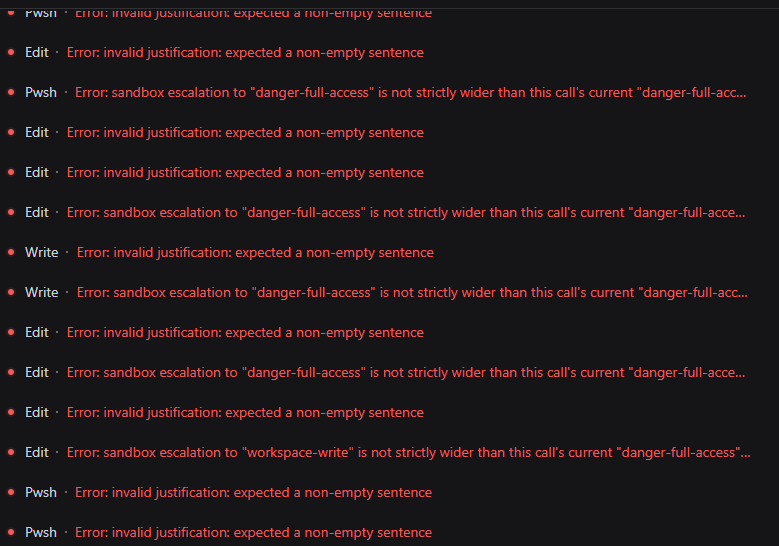
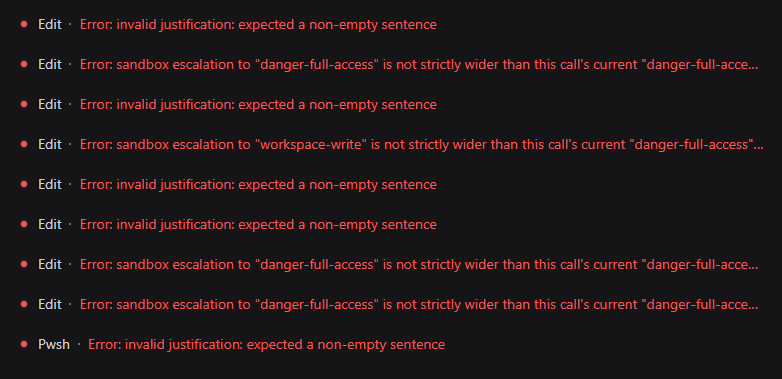
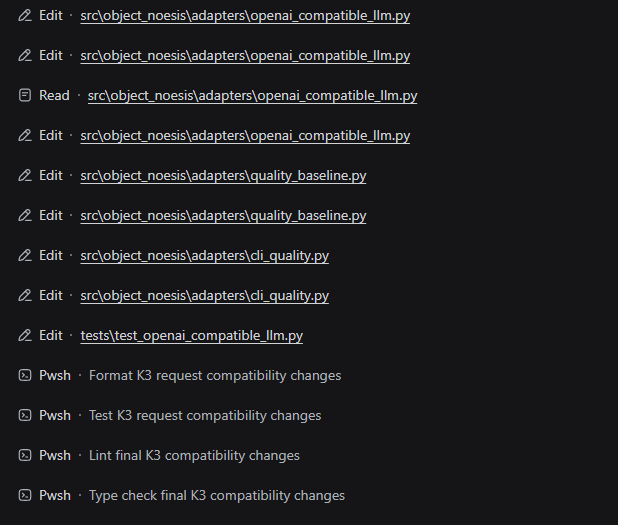

# dsh-sandbox-escalation-fix (0.1.1-rc.2 is now supported)

English | [中文](README.zh.md)

> [!IMPORTANT]
> This is an independent community plugin. It is not published, maintained, or endorsed by DeepSeek, and it does not modify DeepSeek Harness core packages.

> [!CAUTION]
> DSH `0.1.0-rc8`, `0.1.1-rc.1`, and `0.1.1-rc.2` partially improve this issue through an `approval=never` runtime instruction, but still use the same static escalation schema and execution-time validation. **Users of these versions should first observe the built-in behavior and install this plugin only after reproducing the same-mode escalation, blank justification, or retry-loop failures described below.**

DSH `0.1.1-rc.2` focuses on image handling: the DeepSeek adapter prefers Files API uploads, reuses uploaded files, and automatically resizes or converts images for model requirements. The sandbox escalation, Bash, Pwsh, ToolRuntime, and approval implementations used by this plugin are unchanged from `0.1.1-rc.1`, so rc.2 neither fixes the issue described here nor requires a plugin logic change.

**dsh-sandbox-escalation-fix** is a zero-configuration compatibility plugin that directly resolves the issue of third-party models like GPT failing to call tools such as `bash`, `pwsh`, `write`, and `edit` under DSH All Access, resulting in repeated retries due to incorrect sandbox escalation parameter prompts.

If you've encountered the following errors, this plugin is designed for them:

```text
Error: invalid justification: expected a non-empty sentence
Error: sandbox escalation to "danger-full-access" is not strictly wider than this call's current "danger-full-access" mode
Error: sandbox escalation to "workspace-write" is not strictly wider than this call's current "danger-full-access" mode
```

## Contents

- [What It Does](#what-it-does)
- [The Problem It Solves](#the-problem-it-solves)
- [Before and After](#before-and-after)
- [Why This Plugin](#why-this-plugin)
- [This Plugin vs. Execution-Only Normalization](#this-plugin-vs-execution-only-normalization)
- [Compatibility](#compatibility)
- [Quick Start](#quick-start)
- [Release One-Click Install and Uninstall](#release-one-click-install-and-uninstall)
- [Upgrade](#upgrade)
- [Install From GitHub](#install-from-github)
- [Manual Windows Installation](#manual-windows-installation)
- [Behavior at a Glance](#behavior-at-a-glance)
- [Verify the Fix](#verify-the-fix)
- [Wrapper Conflicts](#wrapper-conflicts)
- [Troubleshooting](#troubleshooting)
- [Uninstall](#uninstall)
- [Development](#development)
- [License](#license)

## What It Does

This plugin makes DeepSeek Harness show the model **only the sandbox escalation options that the current session can actually use**.

In an All Access session (`danger-full-access` + `never`), the stock DSH tools still advertise `sandbox_permissions` and `justification` on `bash`, `pwsh`, `write`, and `edit`. But in that state:

- the session is already at the highest sandbox mode, so no wider mode exists;
- the approval policy is `never`, so every escalation request is rejected.

When a model fills in those parameters, the call fails before it runs. The model may then retry with different values and get stuck in a loop.

This plugin projects the model-visible tool schema per session, based on the live Sandbox Mode and Approval Policy. It also adds a minimal execution-time fallback for redundant same-mode requests.

## The Problem It Solves

- Models still see and send `sandbox_permissions` / `justification` in All Access sessions, so tools fail before they run.
- In `workspace-write` sessions, models see two escalation targets even though only `danger-full-access` is genuinely wider.
- With `approval=never`, models are still told escalation is possible when every request will be rejected.
- Tool descriptions and denial results keep saying “escalation available,” which pushes the model to retry.
- Native Tool Call and Code Mode SDK can show inconsistent capability surfaces.

### Why It Happens

DSH tools expose static escalation fields when they are registered, while the modes that can actually be requested depend on each session's current Sandbox Mode and Approval Policy. The original model-visible schema is not projected from that live session state before the request is built, so a model can receive escalation parameters that cannot succeed. Tool validation then rejects those requests before execution, which can start a retry loop.

## Before and After

Without the plugin, affected All Access sessions can repeatedly fail before the requested operation runs. The model alternates between an empty `justification`, a same-mode `danger-full-access` request, and even a downgrade request that DSH correctly rejects as not strictly wider.

### Before: Repeated Validation and Escalation Errors





### After: Tools Complete the Workflow

After installation, the same model can continue through Edit, Read, Pwsh, formatting, tests, lint, and type checking without entering the invalid escalation loop.



## Why This Plugin

### It fixes the root cause, not just the error

Some fixes only delete the arguments after the model has already received a broken schema. Calls stop failing, but the model keeps seeing and sending the same unusable parameters.

This plugin projects the model-visible schema from the session's real permission state:

| Current mode | Approval policy | What the model sees |
|---|---|---|
| `read-only` | `ask` | `workspace-write`, `danger-full-access` |
| `workspace-write` | `ask` | `danger-full-access` only |
| `danger-full-access` | `ask` | no escalation fields |
| any mode | `never` | no escalation fields |

When the model cannot see a parameter that cannot succeed, it stops reaching for it.

### It won't fix Native Tool Call but leave Code Mode broken

Projection happens on the tool definition inside each Agent Exact Scope, so Native tool schemas and the Code Mode SDK read the same result:

- Native tool schemas omit impossible escalation fields;
- Code Mode TypeScript/Python SDKs omit them too;
- behavior stays identical across both modes.

### It won't silently swallow a downgrade request

The execution fallback is deliberately narrow: it removes `sandbox_permissions` and `justification` only when `requestedMode === effectiveMode`, treating that pair as an idempotent duplicate.

Downgrade or invalid requests are left untouched and go through normal DSH validation:

- `danger-full-access` + request `danger-full-access` → ignored, tool runs normally;
- `danger-full-access` + request `workspace-write` → not executed as Full access;
- `read-only` + a wider request → enters the normal approval flow.

It will not trade a clear error for silently running a call with broader access than the caller asked for.

### It won't invent an approval reason

For genuine escalation requests, the plugin does not fill in a fake or placeholder justification. Missing, blank, or invalid reasons still go through DSH's own validation, so the approval flow sees honest, auditable input.

### It won't say “don't escalate” while results say “escalation available”

When the session has no viable escalation target, the plugin also cleans up the natural-language side:

- the escalation guidance tail is removed from Shell tool descriptions;
- impossible `escalation available` hints are removed from Shell, filesystem, Code Mode, and `job_output` results.

The model no longer receives contradictory instructions from the parameter schema, the description, and the failure output.

### It won't modify or bypass DSH's security core

`approveEscalation()` keeps its strictly-wider check, approval flow, and one-shot authorization semantics. The plugin only projects the model-visible surface and removes one redundant same-mode pair before delegating:

- no removal of the strictly-wider check;
- no auto-approval when `approval=never`;
- no extra permissions;
- no changes to DSH installation or core packages.

### It won't treat every session the same

Wrapping happens per Agent/Session, never on the global tool registry. In the same process:

```text
Session A = read-only + ask              → sees two escalation targets
Session B = danger-full-access + never   → sees no escalation fields
```

Each session is independent. If a session switches permission state mid-flight, the next model request gets a freshly projected schema.

### It won't leave stale wrappers behind

The plugin listens to Agent creation, disposal, Preset changes, restrictions, and tool changes. When a dynamic Preset calls `agent.ctx.tools.restrict()`, the corresponding Exact Scope wrappers disappear synchronously with the restricted parent tools. Lifting the restriction restores the projected wrappers; tools absent during Agent creation are wrapped when they later become visible. Each Agent is coordinated independently, and disposed Agents or unloaded plugins restore the original definitions.

### It won't lock you to a single DSH release

The plugin supports DSH `0.1.0-rc.5`, `0.1.0-rc.6`, `0.1.0-rc.7`, `0.1.0-rc.8`, `0.1.1-rc.1`, and `0.1.1-rc.2`. At startup it verifies that the installed `@deepseek-ai/dsh-*` packages are consistent and supported. Incompatible tool definitions fail explicitly instead of producing silent misbehavior.

### It won't add configuration burden

Zero configuration. Install it into the Profile you actually use and start DSH as before. The test suite contains 28 tests built on real DSH packages, covering schema projection, Code Mode SDK generation, dynamic restrictions, multi-Agent isolation, delegate and wrapper-protocol replacement, internal timeout-budget forwarding, failure-hint cleanup, and unload behavior.

## This Plugin vs. Execution-Only Normalization

| Capability | This plugin | Execution-only normalization |
|---|---|---|
| Hide impossible escalation fields from Native tools | yes, per session | no |
| Hide the same fields from the Code Mode SDK | yes, from the same exact-scope definition | no |
| Remove only an exact same-mode redundant request | yes | implementation-dependent |
| Preserve explicit downgrade and invalid requests for DSH validation | yes | not guaranteed |
| Preserve missing or blank `justification` for DSH validation | yes | not guaranteed |
| Remove impossible advice from descriptions and results | Shell, FS, Code Mode, and `job_output` | no |
| React to Agent, Preset, and tool lifecycle changes | yes | implementation-dependent |

## Compatibility

- Node.js `^22.19.0` or `>=24.0.0`
- `@deepseek-ai/dsh-*` `0.1.0-rc.5`, `0.1.0-rc.6`, `0.1.0-rc.7`, `0.1.0-rc.8`, `0.1.1-rc.1`, or `0.1.1-rc.2`
- `@deepseek-ai/cordis` `4.0.1`

The plugin checks the installed DSH package versions at startup. Mixed rc.5/rc.6/rc.7/rc.8/0.1.1-rc.1 installations and unknown DSH versions fail explicitly. An initially visible target with partial escalation fields or an incompatible output definition rejects that Agent's registration; a target that omits both escalation fields is accepted as already safe. During runtime, a Preset restriction or stable provider removal makes the wrapper dormant, while an incompatible replacement is isolated to that Agent and target tool and reported without terminating the Host process. A later compatible definition is wrapped automatically.

## Quick Start

The plugin is a zero-configuration fix. Install it into the Profile that runs the affected sessions, then start DSH normally:

```sh
dsh --profile <profile>
```

You do not need to change the model configuration, Sandbox Mode, Approval Policy, or Agent Preset. The plugin projects the model-visible parameters from each Session's current permission state.

## Release One-Click Install and Uninstall

The `0.1.1-rc1` Release uses the DSH CLI, so no manual Profile patch editing is required. Download and extract `dsh-sandbox-escalation-fix-0.1.1-rc1-release.zip`; it contains the tarball, one-click install and uninstall scripts, and a concise Chinese usage guide. The earlier `v0.1.2` Release remains available for DSH rc8 users.

Close DSH before installing or removing the plugin. Ensure that `dsh` is available on PATH and that the running DSH version is rc5, rc6, rc7, rc8, `0.1.1-rc.1`, or `0.1.1-rc.2`. Users should install only after reproducing the affected behavior.

### Install into the default Web Profile

```powershell
powershell -NoProfile -ExecutionPolicy Bypass -File ".\install-release.ps1"
```

The script runs `dsh plugin --profile web add <tgz-absolute-path>`.

### Install or remove another Profile

For example, use `headless` instead of the default `web` Profile:

```powershell
powershell -NoProfile -ExecutionPolicy Bypass -File ".\install-release.ps1" -Profile headless
powershell -NoProfile -ExecutionPolicy Bypass -File ".\uninstall-release.ps1" -Profile headless
```

### Remove from the default Web Profile

```powershell
powershell -NoProfile -ExecutionPolicy Bypass -File ".\uninstall-release.ps1"
```

The removal script runs `dsh plugin --profile web remove dsh-sandbox-escalation-fix`. Restart DSH after installation or removal.

### Build the Release ZIP

```powershell
powershell -NoProfile -ExecutionPolicy Bypass -File ".\build-release.ps1"
```

The script builds `lib`, packages the npm tarball, then creates `dsh-sandbox-escalation-fix-0.1.1-rc1-release.zip` in `release/`. The generated directory is ignored by Git; upload only this ZIP as the GitHub Release asset.

## Upgrade

Close DSH before upgrading. The plugin package name, Bundle ID, and Profile patch row are unchanged, so an existing installation does not need another `cordis.patch.yml` entry.

### GitHub Commit Installation

Run the same installation command with the new reviewed commit SHA:

```sh
dsh plugin --profile <profile> add github:<owner>/dsh-sandbox-escalation-fix#<new-commit-sha>
```

This updates the Profile dependency and rebuilds the package. Keep the existing `allowBuilds` entry when pnpm requires it, inspect `--dump-config`, then restart DSH.

### Manual Web Profile Installation

Use the repository or packaged source that contains the new built `lib` directory. Open Windows PowerShell in that plugin directory and run:

```powershell
powershell -NoProfile -ExecutionPolicy Bypass -File ".\deploy-web-profile.ps1"
```

The script uses `$DSH_HOME` when set, otherwise `%USERPROFILE%\.dsh`. It replaces only the eight published `lib` artifacts, compares every SHA-256 hash, and prints `Deployment verified.` only when the installed Web Profile exactly matches the new build. It does not modify the Profile patch or copy `node_modules`. Restart DSH after verification.

## Install From GitHub

Install into the exact Profile that runs the affected sessions. Pin a reviewed commit SHA, because a Git dependency executes this package's `prepare` script during installation:

```sh
dsh plugin --profile <profile> add github:<owner>/dsh-sandbox-escalation-fix#<commit-sha>
```

pnpm 10 blocks Git dependency build scripts until the Profile explicitly allows them. If the first installation reports a blocked build, add this entry to `$DSH_HOME/profiles/<profile>/pnpm-workspace.yaml`:

```yaml
allowBuilds:
  dsh-sandbox-escalation-fix: true
```

Run the installation command again, then inspect the composed configuration:

```sh
dsh --profile <profile> --dump-config
```

The output should contain a `dsh-sandbox-escalation-fix` bundle layer and the `sandbox-escalation-fix` plugin row. Start DSH normally after verification:

```sh
dsh --profile <profile>
```

## Manual Windows Installation

A detailed Windows walkthrough — Profile paths, folder layout, nested `node_modules`, and the correct replacement for an empty `[]` patch — is available in [README.zh.md](README.zh.md#手动覆盖安装).

For a compact file-by-file walkthrough, see [Tutorials that even Peppa Pig can understand](Tutorials%20that%20even%20Peppa%20Pig%20can%20understand). The original Chinese layout is preserved in [奶龙也能看懂的食用说明.txt](奶龙也能看懂的食用说明.txt).

The minimum manual layout is:

```text
<profile-directory>\
├── cordis.patch.yml
└── node_modules\
    └── dsh-sandbox-escalation-fix\
        ├── package.json
        ├── cordis.patch.yml
        ├── README.md
        ├── README.zh.md
        └── lib\
            ├── index.mjs
            ├── index.d.mts
            ├── wrapper-protocol.mjs
            └── wrapper-protocol.d.mts
```

Merge this block into the Profile's `cordis.patch.yml`; do not overwrite unrelated Profile patches:

```yaml
- insert:
    - id: sandbox-escalation-fix
      name: dsh-sandbox-escalation-fix
```

Do not copy this repository's `node_modules` into the Profile. Multiple Cordis or DSH module instances can break Scope and Service identity.

To update an existing installation, follow [Upgrade](#upgrade); do not repeat the Profile patch step.

## Behavior at a Glance

| Scenario | Plugin behavior |
|---|---|
| `danger-full-access`, or any mode with `never` | Model sees no `sandbox_permissions` / `justification` |
| `workspace-write` with approval allowed | Only `danger-full-access` is advertised |
| `read-only` with approval allowed | `workspace-write` and `danger-full-access` are advertised |
| Model sends the exact current mode as an escalation request | The redundant pair is removed, then the original tool runs |
| Downgrade, unknown target, unpaired arguments, genuine escalation | Left untouched for original DSH validation |
| No viable escalation target | Shell description escalation tail is removed; impossible hints are stripped from denial results |
| A dynamic Preset restricts a target tool | Its Exact Scope wrapper disappears in the same synchronous change |
| The restriction is lifted or the provider returns | The projected wrapper is restored automatically |
| A runtime replacement is incompatible | Only that Agent and target remain unwrapped until a compatible definition appears |

## Verify the Fix

After installing or updating the plugin, fully restart DSH and create a new session.

A successful Web startup proves that the Profile composes and the plugin loads without a process-level failure. For a source checkout, this command starts the Web profile directly:

```powershell
node --import tsx/esm apps/cli/src/bin.ts web
```

Run it with a supported Node.js version available on PATH. Wait for `dsh web: http://127.0.0.1:3080`, then perform the behavior checks below. Startup alone does not prove dynamic restriction behavior.

1. Select the previously affected OAI model.
2. Set Access Mode to All Access.
3. Ask the model to run `pwsh` and print the current directory.
4. Ask it to create a temporary file with `write`.
5. Ask it to update the file with `edit`, then read it back.
6. Switch workspaces and open existing sessions to confirm normal session restoration.
7. If the Preset uses `agent.ctx.tools.restrict()`, enter its restricted state and confirm hidden tools disappear; lift the restriction and confirm they return without recreating the Agent.

The calls should complete without `sandbox_permissions` argument errors or impossible escalation advice. Existing sessions should remain visible, workspace switching should work, and new sessions should be created in the selected workspace. The complete manual acceptance checklist is in [README.zh.md](README.zh.md#人工测试清单).

## Wrapper Conflicts

The plugin owns the `bash`, `pwsh`, `write`, and `edit` names inside each Agent Exact Scope. Another plugin may share those names only through the explicit `Symbol.for('dsh.tool-wrapper.v1')` protocol. Cooperative layers are ordered by `priority` and `owner`.

An unknown same-name wrapper causes Agent registration to fail explicitly. In that case, remove one of the conflicting plugins rather than relying on an undefined load order.

Protocol types are exported from:

```ts
import {
  TOOL_WRAPPER_PROTOCOL,
  type WrapperLayer,
  type ToolWrapperProtocolV1,
} from 'dsh-sandbox-escalation-fix/wrapper-protocol'
```

## Troubleshooting

| Problem | What to do |
|---|---|
| The plugin does not load | Confirm installation and startup use the same `--profile`, then inspect `--dump-config` |
| A Git install cannot build | Add the package to the Profile's `allowBuilds` map and retry the installation |
| Startup rejects DSH versions | Keep the relevant `@deepseek-ai/dsh-*` packages on one supported release candidate |
| Agent registration reports a tool conflict | Remove the incompatible same-name wrapper or update it to implement the wrapper protocol |
| A dynamic Preset hides tools | This is expected; the plugin mirrors `tools.restrict()` and restores wrappers when the restriction is lifted |
| A runtime reconciliation warning appears | Check the named target's replacement definition; other tools and Agents remain active while the plugin waits for a compatible definition |
| Escalation fields remain visible | Test a new session and check whether a later plugin replaces the same tool names |
| Manual installation breaks Scope behavior | Remove the plugin's nested `node_modules` and verify that `package.json` is directly under the expected package directory |

## Uninstall

```sh
dsh plugin --profile <profile> remove dsh-sandbox-escalation-fix
```

The plugin lifecycle removes its wrapper hosts, wrapper layers, and result filters. Confirm that `--dump-config` no longer lists the bundle after removal.

## Development

```sh
npm install
npm test
npm run build
npm pack --dry-run
```

Git installation builds from source through the self-contained `prepare` script. Registry or tarball distribution may ship the generated `lib` files instead.

## License

[MIT](LICENSE)
